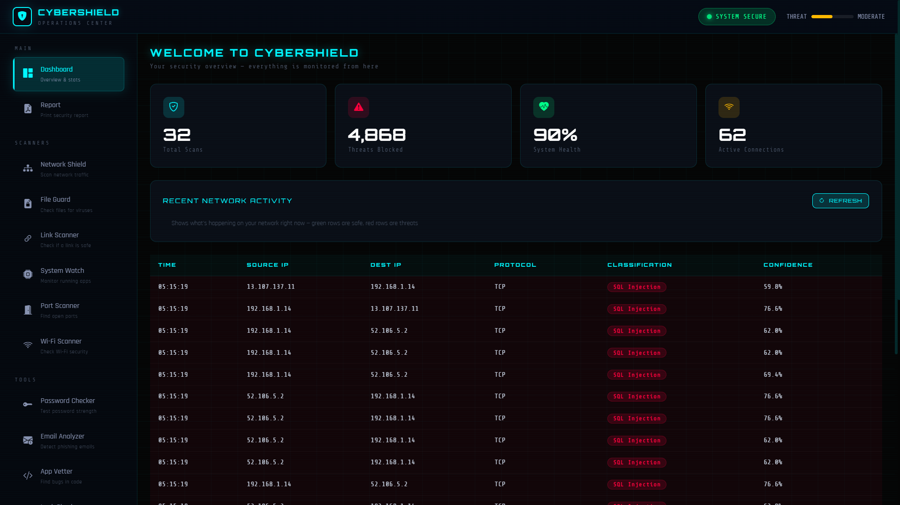
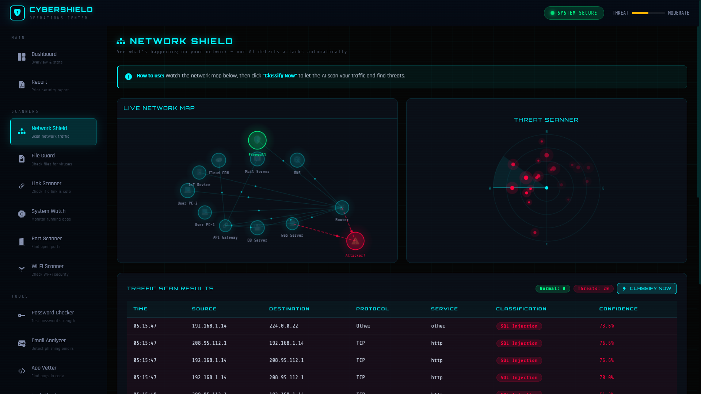
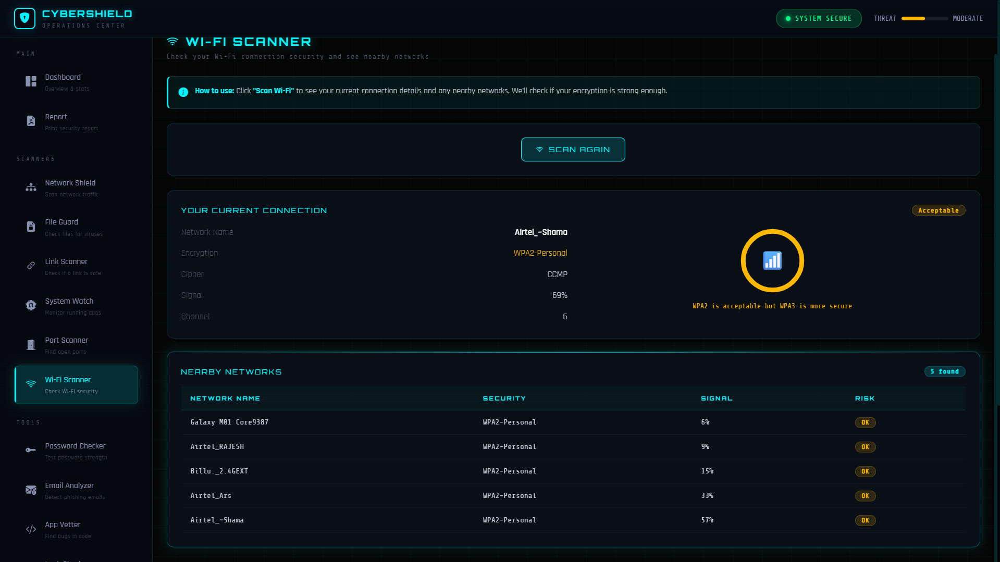
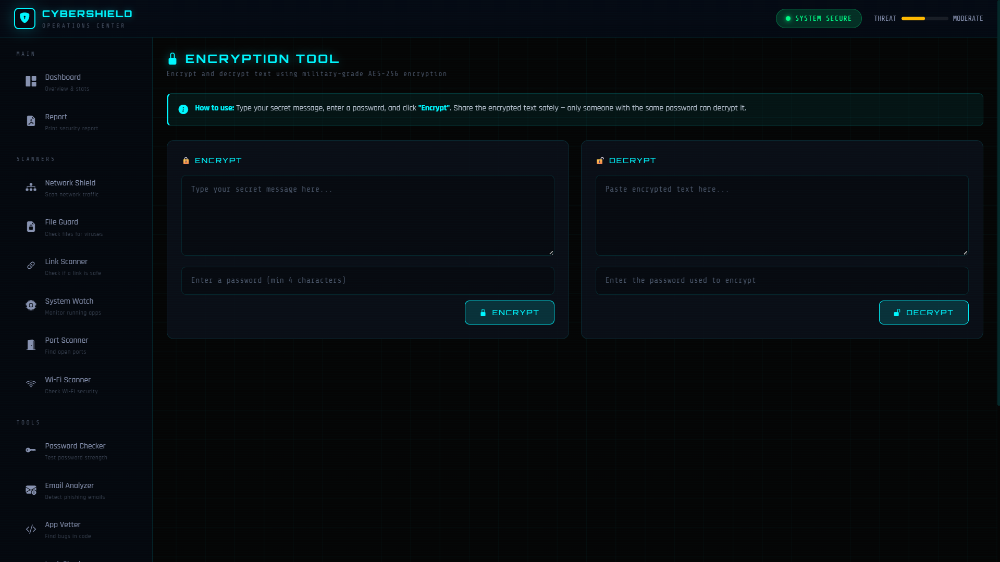
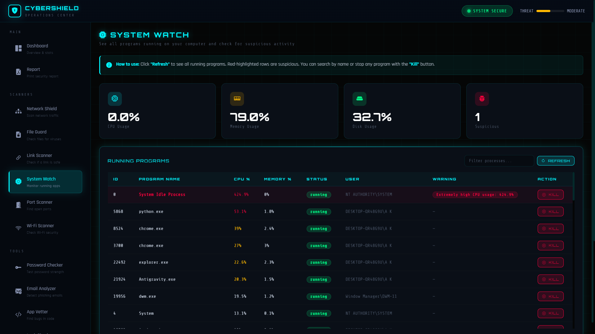
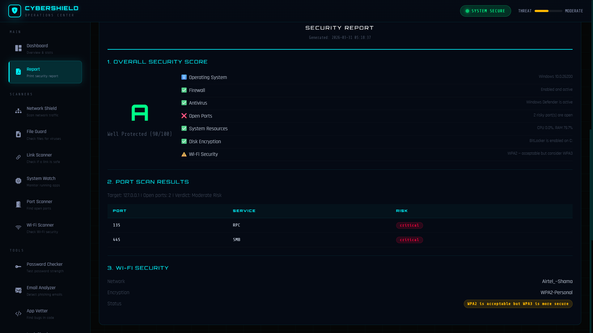

# 🛡️ CyberShield Ultimate - Real-Time SOC


## 📖 Description
**CyberShield Ultimate** is a fully functional, real-time Security Operations Center (SOC) framework powered by Python and Machine Learning. Designed as a comprehensive cybersecurity dashboard, it transcends standard simulations to deliver **live network packet capture**, **AI-driven anomaly detection**, **active process monitoring**, and **threat geolocation**. 

Equipped with a robust suite of 14 integrated security modules, CyberShield Ultimate empowers users to take control of their system's security posture, perform active file vetting, execute port scanning, and generate automated risk reports—all localized in one powerful, highly intuitive interface.

---

## ✨ 14 Integrated Security Modules
1. **🌐 Network Shield:** Real-time packet capture and anomaly detection using an AI model trained on KDD datasets.
2. **🌍 Threat Map:** Live geolocation and mapping of detected cyber threats.
3. **💻 System Watch:** Active system resource monitoring and live process management (kill rogue PIDs).
4. **🛡️ File Guard:** Upload and scan files for malware signatures and malicious indicators.
5. **🔍 Port Scanner:** Actively scan target IPs and common port ranges to identify open vulnerabilities.
6. **🔗 Link Scanner:** Analyze URLs to extract phishing domains and malicious routing.
7. **📶 Wi-Fi Scanner:** Map nearby wireless networks and evaluate their encryption standards.
8. **📧 Email Analyzer:** Deep-parse email headers to track routing and detect spoofing.
9. **🔐 Encryption Tool:** Securely encrypt and decrypt sensitive text payloads.
10. **💧 Leak Checker:** Verify if user emails have been compromised in known data breaches.
11. **🔑 Password Checker:** Evaluate the strength and security of passwords against modern cracking techniques.
12. **📍 IP Lookup:** Retrieve precise Geolocation and ASN details of any IPv4 address.
13. **📜 App Vetter:** Perform static code analysis on uploaded source code to find hardcoded secrets and logic flaws.
14. **📊 Report Generator:** Aggregate all active network data and scan results into comprehensive exportable security reports.

---

## 📸 Screenshots







```

---

## 🚀 Installation Instructions

### Prerequisites
- Python 3.8 or higher
- Npcap or WinPcap (Required for live network packet capture on Windows)
- Git

### Step-by-Step Setup
1. **Clone the repository:**
   ```bash
   git clone https://github.com/Inamulhassan-dev/cybershield-ultimate.git
   cd cybershield-ultimate
   ```

2. **Install Required Dependencies:**
   Install all the necessary Python libraries configured for the environment:
   ```bash
   pip install -r requirements.txt
   ```

3. **Train the AI Model (Initial Setup):**
   Before launching the SOC for the first time, generate the machine learning model (`cyber_model.pkl`) using the included datasets:
   ```bash
   python train_model.py
   ```

---

## ⚙️ How to Run the Project

For a streamlined experience on Windows, use the provided batch scripts:
- **`1_Start_CyberShield.bat`** - Launches the main Flask server.
- **`2_Stop_CyberShield.bat`** - Safely terminates the SOC processes.
- **`3_Check_Health.bat`** - Runs quick system diagnostics before launch.

**Manual Launch (Any OS):**
```bash
python app.py
```
> Access the SOC Dashboard by navigating to `http://127.0.0.1:5000` in your web browser.

---

## 📂 Project Structure

```text
CYBERSHIELD ULTIMATE/
│
├── app.py                      # Main entry point (Flask Application)
├── train_model.py              # ML model training script
├── cyber_model.pkl             # Trained AI classification model
├── requirements.txt            # Python package dependencies
│
├── 1_Start_CyberShield.bat     # Windows App Launcher
├── 2_Stop_CyberShield.bat      # Windows App Terminator
├── 3_Check_Health.bat          # Windows Diagnostics
│
├── core/                       # Backend Logic & Threat Intelligence
│   ├── ai_model.py
│   ├── data_simulator.py
│   ├── event_log.py
│   ├── packet_capture.py
│   ├── scanner.py
│   ├── stats_tracker.py
│   ├── system_monitor.py
│   └── tools.py
│
├── data/                       # Datasets
│   ├── KDDTrain+.txt           # KDD Training Dataset
│   └── KDDTest+.txt            # KDD Testing Dataset
│
├── templates/                  # Frontend HTML Views (14 Modules)
│   ├── dashboard.html
│   ├── [module].html           # Individual module pages
│   └── ...
│
└── static/                     # Assets
    ├── css/                    # Stylesheets
    └── js/                     # Component Scripts
```

---

## 🛠️ Technologies Used
- **Backend:** Python, Flask server
- **Machine Learning:** Scikit-Learn (Anomaly Detection on KDD datasets)
- **Networking:** Socket programming, Subprocess process manipulation
- **Frontend:** HTML5, modern CSS styling, vanilla JavaScript for real-time polling
- **OS Integration:** Windows native APIs for Event Logs and Process mapping

---

## 📄 License

This project is licensed under the [MIT License](LICENSE). You are free to modify and distribute the code, provided that appropriate credit is given.

---

## 👨‍💻 Author

**Inamulhassan**
- GitHub: [@Inamulhassan-dev](https://github.com/Inamulhassan-dev)

Building defensive cybersecurity platforms & innovative tech.
